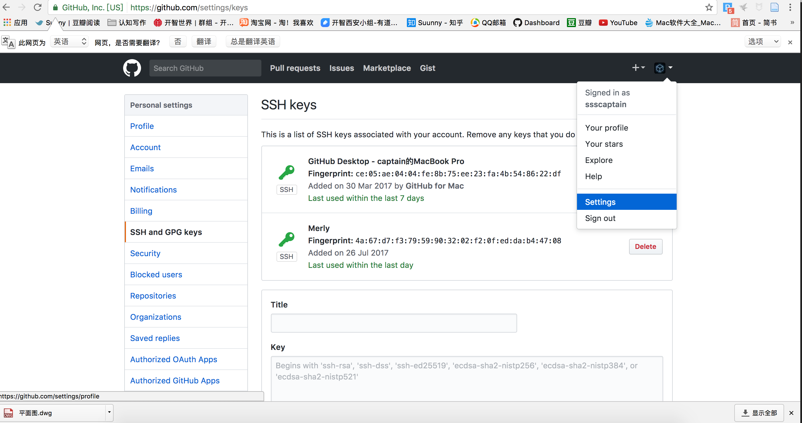
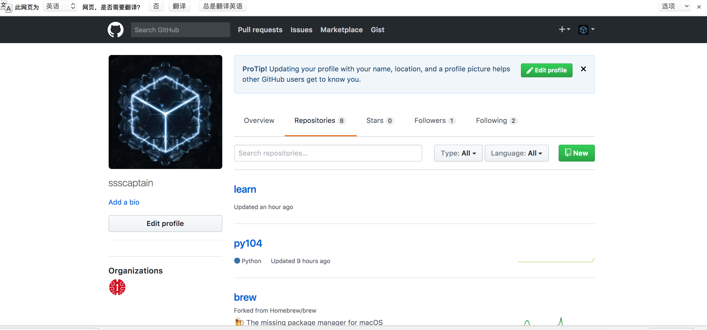

## 作业总结

**其实，这几天被虐惨了！**

盖茨说过：21世纪人人都应掌握的一项技能就是编程！阳老师也说过：这个时代最有前途的职业就是作家与黑客！

而我，两者技能皆为零，今年四月份加入开智以来，被各种满天飞的源头知识轰炸，大脑内的神经元都被炸开了花，

奈何自己一贯强烈的好奇心，望着这些瑰丽的系统和符号，求知欲按捺不住了，奋起直追，直奔元科学的五大高山。虽然过程注定坎坷漫长，但完全挡不住收获沿路的瑰丽惊奇，比如：我从来不知道学编程原来可以这么爽，更可以帮我们解锁另一个世界——`“Hello，World！”`

当时看着打印出来的`"Hello，World！“`，傻乐了半天，开心的练习了前10个章节，之后，就开始各种被虐了：

- 练习课里`def`函数到底是何物，为啥后面要加下划线，为啥到代码后段才给赋值？

- `return`存在的意义到底是啥？

- 转义字符`\`对`引号`到底有啥作用？
可能是英文与计算机均为零基础的缘故，往往对着一串英文字符琢磨半天。一次次在`变量，函数`中间理清关系，

有几次被虐的想掉眼泪，欣慰的是，`True`和`False`的逻辑训练格外顺利，甚至觉得不够尽兴！
由于作业提交期限的临近，只能先交上前30篇的原文和课外练习，提交的时候，那熟悉的虐的感觉，又来了：

- 什么叫`用GIT命令上传文件？`
看到（王大可同学）的GIT使用说明，略感动，给王大可点完赞，就赶紧去下载安装了[GIT](https://git-scm.com/downloads)（好像需翻墙），对着[廖雪峰GIT教程](https://www.liaoxuefeng.com/wiki/0013739516305929606dd18361248578c67b8067c8c017b000/0013752340242354807e192f02a44359908df8a5643103a000),一步步实践。
按着顺序一步步来：
		
		$ mkdir xxx  --------   创建（xxx）项目文件夹
		
		$ cd xxx     --------   打开（xxx）项目文件夹
		
### 下面开始就是 git 命令了，首先是对自己硬盘里的项目仓库创建，添加
		
		$ git init   --------   在此文件夹内创建 git 仓库 
		# 隐藏的目录
		
		$ git add    --------   将项目文件夹内的文件添加至 git 仓库 
		# 多个文件同时添加时，git add 后缀多个文件名用空格隔开
		
		$ git commit -m  --------   将已添加至 git 仓库的文件提交至 git 仓库。 
		# -m 为提交文件的说明.
		
### 接下来是让 git 将本地项目仓库与 GitHub 仓库同步 ，首先是同步 GitHub 账户
		
		$  git config --global user.name "Your Real Name"      
		   
		   git config --global user.email you@email.address   
		   
		   # 这两行命令是为了让本地仓库和 GitHub 上的已有账号绑定
		   
### 创建SSH Key 

		
		$ ssh-keygen -t rsa -C "youremail@example.com"    
		
		# 生成密匙（SSH Key），生成的密匙文件会有个单独文件夹，
		MAC下通过 command + shift + G 可直接查找文件夹位置，
		打开里面的 id_rsa.pub文件，会看到密匙。 复制后， 打开 
		GitHub ---个人界面下 Setting--- SSH and GPG Keys 
		--- New SSH Key  ，将密匙贴在 key 一栏，Add SSH Key，完成
		  
### 在 GitHub 上创建本地仓库的同名仓库
		                                                  
	  如图，在 Repositories 一栏，点击 New ，即可创建，仓库名称需和本地一致。
		
		
### 开始同步
		
		$ git push origin master
		
		# OVER，一切顺利的话，已经能看见同本地仓库一模一样的 GitHub 仓库了。
		
				
		

### “# ：草根梅利”

小白一枚，草根一枚，虽已家庭事业稳定，仍满眼好奇；虽自作虐，但分外满足。

如果对眼前世界的真相都窥探不到一星半点的话，生活再怎么折腾也无多大意义吧！
		
我来啦，同行的伙伴们！